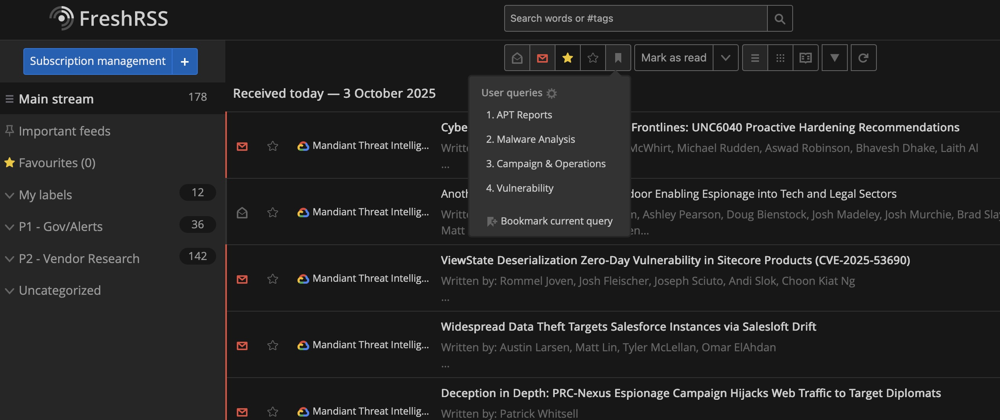

# Personal Cyber Threat Intelligence (CTI) Streamliner



A streamlined, self-hosted system for aggregating, filtering, and categorizing high-value Cyber Threat Intelligence (CTI) feeds. This repository contains not only the Docker setup but also a curated list of CTI feeds (OPML) and the specific search queries needed to build an effective, on-demand intelligence dashboard.

## The Problem: Information Overload
For any security professional, staying updated with the latest threats, vulnerabilities, and APT activity is a daily challenge. The sheer volume of reports from vendors, CERTs, and researchers creates significant noise, making it difficult to find actionable intelligence efficiently.

## The Solution: A Curated & On-Demand CTI Hub
This project uses **FreshRSS**, a powerful open-source RSS aggregator, running in a Docker container to solve this problem. Unlike a fully automated system, this workflow emphasizes an analyst-driven approach. Feeds are pre-sorted into priority categories, and **Bookmarked Searches** are used to perform powerful, on-demand filtering across all sources.

This provides a centralized and clean dashboard for targeted threat intelligence consumption and professional development.

## Key Features
* **🚀 One-Command Deployment:** Uses a `docker-compose.yml` for quick and easy setup.
* **📰 Prioritized CTI Feed List:** Includes a ready-to-import OPML file that categorizes feeds into **P1 - Gov/Alerts** and **P2 - Vendor Research**.
* **🔍 Analyst-Focused Search Queries:** Provides the exact search queries (in the `/Assets/Searches` directory) to create **Bookmarked Searches** for the four core CTI topics:
    * **APT & Threat Actors**
    * **Malware Analysis**
    * **Campaigns**
    * **Vulnerabilities**
* **🔒 Self-Hosted & Private:** You have full control over your data and workflow.

## Tech Stack
* **[FreshRSS](https://freshrss.org/)**: The core RSS aggregator engine.
* **[Docker](https://www.docker.com/)**: For easy, containerized deployment.

## Getting Started

### Prerequisites
* Docker and Docker Compose must be installed on your system.

### Installation
1.  Clone this repository to your local machine:
    ```bash
    git clone [https://github.com/taof211/personal-cti-streamliner.git](https://github.com/taof211/personal-cti-streamliner.git)
    cd personal-cti-streamliner
    ```
2.  Start the FreshRSS container in detached mode:
    ```bash
    docker-compose up -d
    ```
3.  Navigate to `http://localhost:8889` (or the port you defined) in your browser and complete the initial FreshRSS user setup.

## Configuration: The Analyst Workflow
This setup is designed for quick, manual filtering rather than automated categorization.

1.  **Import & Categorize Feeds:**
    * In the FreshRSS web interface, go to `Subscription management`.
    * Click on the `Import` function and upload the `My Report Resources.opml.xml` file from the `Assets/Feeds` directory.
    * This will automatically create two feed categories: **P1 - Gov/Alerts** (for high-priority, official alerts) and **P2 - Vendor Research** (for in-depth technical reports).

2.  **Create Bookmarked Searches:**
    * This is the core of the workflow. Go to the main search bar in FreshRSS.
    * Open one of the search query files from the `/Assets/Searches` directory (e.g., `malware_analysis_search.md`).
    * Copy the entire query string.
    * Paste it into the FreshRSS search bar and run the search.
    * On the search results page, click the **"Bookmark this search"** icon (a star or bookmark symbol).
    * Name the bookmark appropriately (e.g., "Malware Analysis").
    * Repeat this process for all four search query files. You will now have four powerful, one-click filters in your main navigation pane.

    > ### ⚠️ Important Note on Search Queries
    > The search query files in the `/Assets/Searches` directory contain comments and line breaks for readability and maintainability. **These must be removed before pasting the query into the FreshRSS search bar.**
    >
    > **Action:** Please copy the raw query text and manually delete any comment lines and extra line breaks to form a single-line search string. This is necessary to ensure the search functions correctly in FreshRSS. It is recommended to keep the original file format unchanged for future maintenance.

## My Personal Workflow
My daily process with this system is analyst-driven:

1.  **Initial Scan:** I first check the **P1 - Gov/Alerts** category for any critical, time-sensitive information.
2.  **Targeted Research:** Instead of browsing all feeds, I use my **Bookmarked Searches** to pull exactly what I need. For instance, if I want the latest research on malware, I simply click the "Malware Analysis" bookmark. This instantly filters thousands of articles across all my P1 and P2 feeds to show only the most relevant reports.

This approach keeps my main feed clean and allows me to conduct targeted research with incredible speed and efficiency.